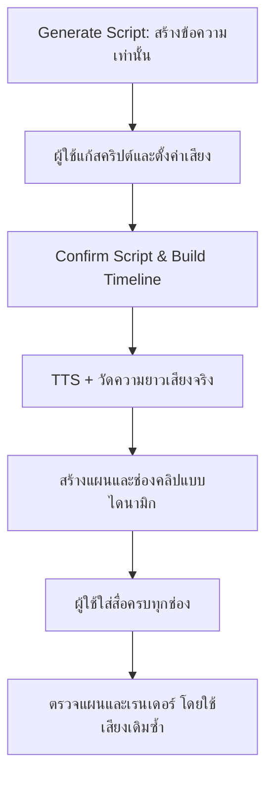

เอกสารนี้อธิบายสถาปัตยกรรมที่ใช้แก้ข้อจำกัดเดิมของ VideosTurbo-SixClip: เสียงพากย์ยาวกว่า 60 วินาที แต่ระบบเดิมมีช่องคลิปคงที่ 6 ช่อง ช่องละ 10 วินาที

## เป้าหมาย

- สคริปต์สามารถยาวได้ตามที่ผู้ใช้ต้องการ ภายใต้ข้อจำกัดการตั้งค่าของระบบ
- การสร้างสคริปต์เป็นงานข้อความเท่านั้น ผู้ใช้แก้สคริปต์และตั้งค่าเสียงก่อนมีค่าใช้จ่าย TTS (Text-to-Speech: การแปลงข้อความเป็นเสียง)
- หลังผู้ใช้กด **Confirm Script & Build Timeline** ระบบสร้างหรือใช้เสียงพากย์ฉบับเต็มที่ยืนยันแล้ว วัดความยาวจริง แล้วเพิ่มจำนวนช่องคลิปให้พอดี
- การสร้างวิดีโอสุดท้ายใช้เสียงฉบับเดิมซ้ำ ไม่สร้าง TTS ซ้ำโดยไม่จำเป็น
- ผู้ใช้ต้องใส่สื่อของตนเองครบทุกช่อง ไม่มีสื่อสต็อกมาแทนโดยอัตโนมัติ

ระบบนี้ตั้งใจ **ไม่** เพิ่มความเร็วเสียงโดยอัตโนมัติ เพราะความเร็วเป็นการตัดสินใจด้านคุณภาพของผู้ใช้ และไม่ใช้วิธีวนซ้ำ 6 คลิปแรก

## กฎคำนวณหลัก

ให้หนึ่งช่องมีความยาว 10 วินาที และต้องมีอย่างน้อย 6 ช่อง:

```text
clip_count = max(6, ceil(narration_duration_seconds / 10))
timeline_duration_seconds = max(60, narration_duration_seconds)
```

| ความยาวเสียงจริง | จำนวนช่อง | ช่วงเวลาสุดท้าย |
| ---: | ---: | --- |
| 58 วินาที | 6 | 50–60 วินาที |
| 63 วินาที | 7 | 60–63 วินาที |
| 127 วินาที | 13 | 120–127 วินาที |

`app.max_dynamic_clip_count = 0` หมายถึงไม่กำหนดเพดานจำนวนช่อง หากตั้งค่าเป็นค่าบวก ระบบจะหยุดพร้อมข้อความผิดพลาดเมื่อเสียงต้องใช้ช่องมากกว่าค่านั้น

## ภาพรวมการไหลของข้อมูล



## องค์ประกอบหลัก

| ชั้น | ไฟล์หลัก | หน้าที่ |
| --- | --- | --- |
| WebUI (หน้าจอเว็บ) | `webui/Main.py` | รับสคริปต์/ค่าเสียง, ยืนยันแผน, ตรวจความใหม่ของแผน, ส่งงานเรนเดอร์ |
| Timeline UI (หน้าจอไทม์ไลน์) | `webui/six_clip_timeline.py` | แสดงช่องคลิปจำนวนเท่าใดก็ได้, แบ่งหน้า, รับ URL/อัปโหลดสื่อ, แสดงสถานะสื่อ |
| Model (แบบจำลองข้อมูล) | `app/models/six_clip.py` | นิยาม `SixClipPlan` และ `SixClipSegment` พร้อมตรวจช่วงเวลาและลำดับช่อง |
| Planning service (บริการวางแผน) | `app/services/six_clip_plan.py` | คำนวณช่วงเวลา, สร้างแผนจาก LLM (Large Language Model: โมเดลภาษาขนาดใหญ่), สร้าง Prompt เป็นชุดละไม่เกิน 6 คลิป |
| Media service (บริการสื่อ) | `app/services/six_clip_media.py` | ดาวน์โหลด URL, บันทึกไฟล์อัปโหลด, ตรวจชนิดสื่อ, ย้ายสำเนาสื่อเข้าโฟลเดอร์งาน |
| Task/render pipeline (สายงานเรนเดอร์) | `app/services/task.py`, `app/services/video.py` | ตรวจแผนและสื่อก่อนเริ่ม, ใช้เสียงที่ยืนยันแล้ว, ต่อสื่อและทำวิดีโอสุดท้าย |
| State and voice (สถานะและเสียง) | `app/services/voice.py`, Session State | เก็บเสียงตัวอย่างฉบับเต็ม, fingerprint (รหัสลายเซ็นของข้อมูล), เวลาจริงและ subtitle cues (จังหวะซับไตเติล) |

## วงจรชีวิตของแผน

### 1. สร้างสคริปต์โดยยังไม่สร้างเสียง

`Generate Script & Keywords with AI` สร้างข้อความสคริปต์เท่านั้น ผู้ใช้จึงแก้เนื้อหา เลือกผู้ให้บริการเสียง ชื่อเสียง ความเร็ว และระดับเสียงได้ก่อนเรียก TTS ฉบับเต็ม

### 2. ยืนยันสคริปต์และสร้าง Timeline

`confirm_script_and_build_timeline(...)` ใน `webui/Main.py` ทำงานตามลำดับ:

1. สร้าง fingerprint จากสคริปต์, ผู้ให้บริการ, ชื่อเสียง, ความเร็ว, ระดับเสียง และค่าเกี่ยวข้องที่ไม่เป็นความลับ
2. ใช้ full voice preview (เสียงตัวอย่างฉบับเต็ม) เดิม หาก fingerprint ตรงกัน; ถ้าไม่ตรงจึงเรียก TTS
3. อ่าน `duration` จากเสียงจริง ไม่ใช้การประมาณจำนวนคำ
4. เรียก `build_timeline_ranges(...)` เพื่อสร้างช่วงเวลา 0–10, 10–20, … จนถึงปลายเสียงจริง
5. ส่งช่วงเวลาที่กำหนดแล้วให้ LLM สร้าง title, narration context และ video prompt สำหรับทุกช่อง
6. เก็บ `SixClipPlan` ใน Streamlit session state (สถานะของหน้าจอ)

### 3. แก้ไขสื่อใน Timeline

`render_six_clip_sections(...)` แสดงการ์ดตามจำนวน `segments` จริง โดยแบ่งหน้า 6 การ์ดต่อหน้าเพื่อให้ Timeline ยาวยังใช้งานได้ ผู้ใช้ใส่สื่อได้สองทาง:

- URL โดยระบบดาวน์โหลดทันทีเป็นสำเนาในพื้นที่จัดเก็บของ session
- Upload (อัปโหลด) เป็นไฟล์ภาพหรือวิดีโอ

ระบบตรวจชนิดไฟล์จาก magic bytes (ลายเซ็นจริงในเนื้อไฟล์) ไม่เชื่อเฉพาะนามสกุลหรือ HTTP Content-Type (ชนิดข้อมูลที่เซิร์ฟเวอร์แจ้ง) เพื่อลดกรณี URL ส่งหน้า HTML หรือไฟล์ผิดชนิดเข้าระบบเรนเดอร์

### 4. ตรวจความใหม่ก่อน Render

ก่อนเริ่มงาน ระบบคำนวณ fingerprint ปัจจุบันอีกครั้ง หากสคริปต์, provider, voice, speed หรือ volume เปลี่ยนไป แผนเดิมจะเป็น stale (ไม่ตรงกับค่าใหม่) และระบบบล็อกการเรนเดอร์จนกว่าผู้ใช้จะยืนยัน Timeline ใหม่

การตรวจนี้ป้องกันความผิดพลาดสำคัญสองแบบ:

- จำนวนช่องถูกสร้างจากเสียงเก่า แต่ผู้ใช้กำลังจะเรนเดอร์ด้วยเสียงใหม่
- ใช้ไฟล์เสียงที่ผู้ใช้ไม่ได้ยืนยันหลังแก้สคริปต์หรือความเร็ว

### 5. ส่งงาน Render

ก่อนส่งงาน `materialize_plan_for_task(...)` จะตรวจว่าทุกช่องมีสื่อที่มีอยู่จริงและขนาดมากกว่า 0 จากนั้นคัดลอกสื่อเข้าโฟลเดอร์ของ Task (งาน) เพื่อไม่ให้การลบหรือเปลี่ยนไฟล์จากหน้า WebUI กระทบงานที่กำลังทำ

สายงานเรนเดอร์ใช้ `SixClipPlan` เดียวกันเป็นแหล่งข้อมูลจริงสำหรับ:

- ลำดับสื่อ
- ความยาวของแต่ละช่วง
- ความยาว Timeline สุดท้าย
- เสียงพากย์ฉบับที่ยืนยันแล้ว
- จังหวะซับไตเติล

## Model และ Invariants

`SixClipPlan` เป็นสัญญาข้อมูลกลางระหว่างหน้า WebUI, Task และ Renderer โดยบังคับว่า:

- `segments` เริ่ม index ที่ 1 และต้องต่อเนื่อง
- จำนวน `segments` ต้องตรงกับสูตรจากความยาวเสียง
- ช่วงเริ่ม/สิ้นสุดของทุก segment ต้องติดกันและตรงกับ slot 10 วินาที
- ช่องสุดท้ายตัดจบที่ความยาวเสียงจริงได้ เช่น 60–63 วินาที
- `timeline_duration_sec` ต้องเป็นค่าสูงสุดระหว่าง 60 วินาทีและความยาวเสียงจริง
- ถ้ากำหนด `media_kind` ต้องมี `media_path` และกลับกัน

การบังคับกฎใน Model ทำให้ต่อให้ข้อมูลมาจากประวัติงานเก่า, Session State หรือ API ก็ไม่สามารถส่ง Timeline ที่จำนวนช่องหรือช่วงเวลาผิดเข้าสู่ Renderer ได้

## การรองรับประวัติเดิม

ชื่อสาธารณะเดิม เช่น `SixClipPlan`, `SixClipSegment` และ prefix `six_clip_*` ถูกเก็บไว้เพื่อให้ประวัติ Task และงาน Cloud Agent ที่อ้างชื่อเหล่านี้ยังใช้งานได้

เมื่อโหลด Task เก่า ระบบพยายามคืนค่าแผน 6 ช่องเดิม หาก path สื่อเก่าไม่มีไฟล์อยู่แล้ว จะล้างเฉพาะข้อมูลสื่อและแสดงว่า Media Missing (สื่อยังไม่พร้อม) แทนการแทนที่ด้วยสื่อสต็อกอย่างเงียบ ๆ

## การป้องกันความผิดพลาด

| สถานการณ์ | พฤติกรรมของระบบ |
| --- | --- |
| เสียงยาวกว่า 60 วินาที | เพิ่มช่องตามสูตร ไม่หยุดด้วยข้อผิดพลาด 60 วินาที |
| TTS ไม่มีเสียง/สร้างเสียงไม่สำเร็จ | ไม่สร้างแผน และแจ้งความผิดพลาดก่อนสร้างวิดีโอ |
| เปลี่ยนสคริปต์หรือค่าเสียงหลังยืนยัน | ติดสถานะ stale และต้องยืนยันใหม่ |
| ขาดสื่อในช่องใดช่องหนึ่ง | ล็อกการเรนเดอร์ พร้อมระบุเลขช่องและช่วงเวลา |
| URL ไม่ใช่สื่อที่รองรับ | ปฏิเสธก่อนนำเข้า Task |
| Task เก่าชี้ไปยังไฟล์สื่อที่หาย | เก็บข้อความ/Prompt เดิม แต่ล้างสื่อที่ใช้ไม่ได้ |
| เกิน `max_dynamic_clip_count` | หยุดก่อนสร้างแผน พร้อมบอกจำนวนช่องที่ต้องใช้ |

## ข้อจำกัดและแนวทางต่อยอด

ระบบปัจจุบันทำให้วิดีโอยาวกว่า 60 วินาทีได้จริง แต่ยังต้องให้ผู้ใช้จัดหาสื่อทุกช่องเอง และ LLM Prompt ถูกแบ่งเป็นชุดละสูงสุด 6 คลิปเพื่อให้เหมาะกับผู้ให้บริการสร้างวิดีโอ

สำหรับวิดีโอที่ยาวขึ้นมาก ควรต่อยอดเป็น:

1. ตัวเลือกความยาว slot เช่น 5, 10 หรือ 15 วินาที
2. Batch queue (คิวแบบเป็นชุด) สำหรับสร้างและตรวจสื่อจำนวนมาก
3. การบันทึกสถานะราย clip เพื่อให้หยุดแล้วทำต่อได้
4. Timeline editor (ตัวแก้ไขไทม์ไลน์) สำหรับย้าย ตัด หรือรวมช่วงเสียง
5. การประมาณค่าใช้จ่าย TTS/LLM/Video ก่อนยืนยันการสร้าง
6. การทดสอบ End-to-End (ทดสอบตั้งแต่ต้นจนจบ) ด้วยเสียงและสื่อจริงหลายความยาว

## สถานะ ณ เวอร์ชันนี้

ระบบ Dynamic Clip Timeline อยู่บนสาขา `feature/six-clip-media-timeline` ที่ commit `849839d` และผ่าน Python 3.11, Python 3.13 และ Windows smoke tests (การทดสอบพื้นฐานบน Windows) ใน GitHub Actions

มีข้อความตกค้างในหน้า Video Settings ที่ยังระบุว่า “six fixed user media clips (6 × 10 seconds)” ข้อความนี้ไม่ตรงกับสถาปัตยกรรมและพฤติกรรมจริงของระบบ จึงควรแก้ใน commit แยกก่อน Merge เพื่อไม่ให้ผู้ใช้เข้าใจว่าระบบยังจำกัด 6 ช่อง
